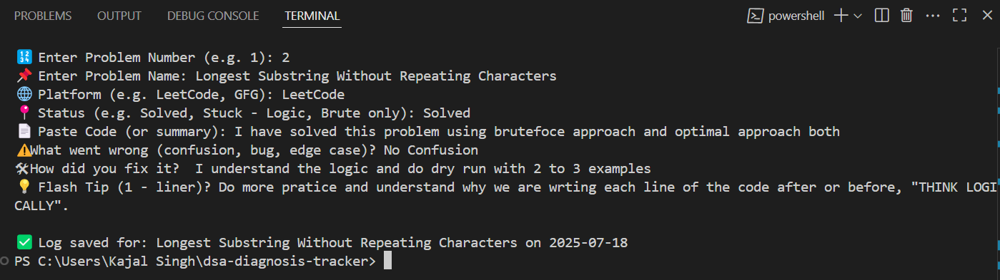
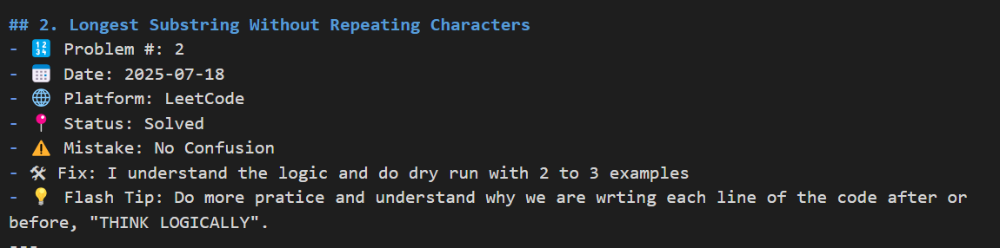

# 🧠 DSA Diagnosis Tracker

Track your DSA problem-solving journey, log mistakes, fixes, and pro tips — and turn them into a powerful revision and interview prep tool.

---

## 📌 Project Purpose

This is a **CLI-based DSA mistake tracker** where you:
- Log every problem you practice or revise
- Highlight what went wrong (bugs, confusion, edge cases)
- Record how you fixed it
- Export everything to Markdown for clean reviews or GitHub display

> Designed to build **debugging discipline**, **self-awareness**, and become an **SDE-ready problem solver**.

---

## ⚙️ Features

✅ Add logs with:
- Problem number and name  
- Platform (LeetCode, GFG, etc.)  
- Code snippet or summary  
- Mistake highlight  
- Fix summary  
- Flash tip (1-liner)  

✅ Search & Filter logs:
- By keyword  
- By date  
- By problem number  

✅ Export:
- One-click export to clean Markdown for GitHub or personal review

---

## 📁 Project Structure

dsa-diagnosis-tracker/
├── data/
│ └── notes.json # Stores all logged problems and reflections
│
├── scripts/
│ ├── add_note.py # CLI to log a new DSA struggle
│ ├── filter_notes.py # Filter logs by keyword, date, or problem number
│ ├── search_notes.py # Search entries using keyword or index
│ └── export_md.py # Export notes to a readable Markdown format
│
├── screenshots/
│ ├── add_note_cli.png # Screenshot: CLI log input
│ └── markdown_export.png # Screenshot: Markdown preview output
│
├── README.md # Documentation and usage
├── requirements.txt # (Optional) Python dependencies
├── .gitignore # Ignore unnecessary files (e.g., pycache)
└── LICENSE # License for open-source use

🧪 Example Markdown Export
## 1. Longest Consecutive Sequence
- 🔢 Problem #: 1
- 📅 Date      : 2025-07-18
- 🌐 Platform  : LeetCode
- 📍 Status    : ⚠️ Stuck - Brute Force Confusion
- ⚠️ Mistake    : Confused between two for loops vs for + while
- 🛠 Fix        : Used correct outer loop + inner while structure
- 💡 Flash Tip  : Brute = outer + inner while
---

💡 Why Use This?

✅ Helps with:

Interview prep & debugging memory

Identifying repeated weak spots

Turning daily practice into a long-term asset

✨ Future Ideas
Add topic & difficulty tags

Topic-wise markdown exports

Web dashboard using Streamlit or React

Sync with LeetCode API or GitHub Gists
---

## 🖼️ Screenshots

### 🧾 CLI Log Entry Example

### 📊 Markdown Export Sample

## 👨‍💻 Author

  <strong>🔹 Ankit Kumar</strong> 

  

  

